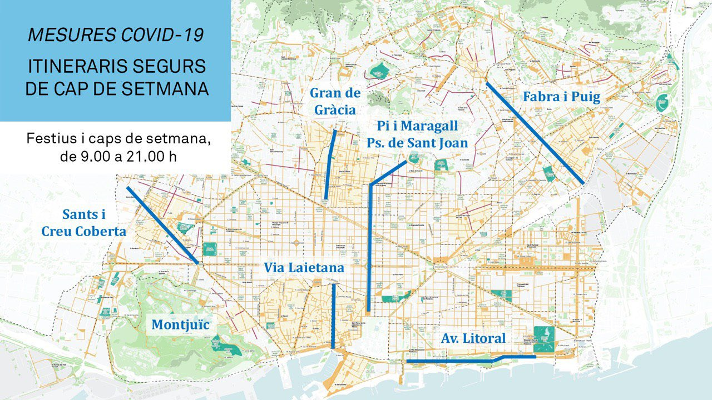

## Pre-Corona

Barcelona had started this year with a program called *Obrim Carrers* as part of its efforts to fight climate emergency. The goal was to *"enjoy a city free of exhaust fumes, motorbikes, cars and noise"* by opening major streets in different parts of Barcelona just for pedestrians, bikes, etc. for a part of the weekend [^1](https://www.barcelona.cat/obrimcarrers/en). This should be accompanied by several activities like games for children or concerts. The plan was to close these streets once a month and only for a few hours during late Saturday or early Sunday.

The following streets were selected:

* Via Laietana
* Creu Coberta - C/ Sants axis
* Carrer Gran de Gràcia
* Carrer Aragó

If you check the map you will see that this itself was a bold move, since it prevents cars from using some of the major axes in Barcelona. Especially the (green colored) *Carrer Aragó* is a much-used artery to get in a car from northeast to southwest. Data from 2018 tells us that on a normal workday 85.000 vehicles use that street [^2](https://www.bcn.cat/estadistica/castella/dades/anuari/cap15/C1511010.htm). Unfortunately, there is no data for weekends, so we can't say how many motorized vehicles were forced to use a different route while the street was closed.

This whole event took place only once before Corona put plans to an abrupt hold, but that one time was a success in terms of visitors. The streets were full of people strolling around. [^3](https://www.elperiodico.com/es/barcelona/20200308/calle-arago-sin-coches-obrim-carrers-7880527)

## Oh, Corona

Fast-forwarding to May 2020: Major cities all around the world have announced plans to give people more space for walking and cycling as a measurement to reduce the spread of the virus. So it came to no surprise that there would be also something happening in Barcelona. The plan was finally announced in mid-May when Barcelona finally moved to phase 1 of the confinement.

You can see that, though they have moved *Carrer Aragó* from the list, this plan is far more advanced since it keeps out motorized traffic throughout the whole weekend (from 9 am to 9 pm) for even more streets and the whole Montjuic. This is especially interesting for a street like *Carrer de Sants*, which is claimed to be Europe's longest commercial road [^4](https://en.wikipedia.org/wiki/Carrer_de_Sants,_Barcelona), and has 4 lanes with a speed limit 50 km/h (which is mostly ignored) running through it. You can imagine how much "phun" it is to go shopping with this noise and the induced stress.

 *Carrer de Sants on a Saturday during phase 1 after the corona-virus outbreak*

What is interesting to recognize is that the association of the shop owners on that street is in favor of this! It needed a pandemic to initiate this and the local politicians will try to keep that state even after everything will back to normal.

https://twitter.com/ancormesa/status/1266762580401500161