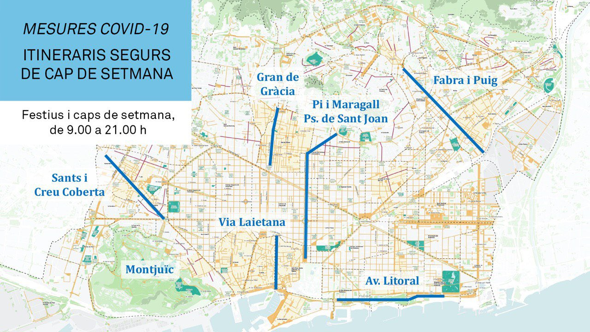

## Pre-Corona

Barcelona had started this year with a program called *Obrim Carrers* as part of its efforts to fight climate emergency. The goal was to *"enjoy a city free of exhaust fumes, motorbikes, cars and noise"* by opening major streets in different parts of Barcelona just for pedestrians, bikes, etc. for a part of the weekend [^1](https://www.barcelona.cat/obrimcarrers/en). This should be accompanied by several activities like games for children or concerts. The plan was to close these streets once a month and only for a few hours during late Saturday or early Sunday.

The following streets were selected:

* Via Laietana
* Creu Coberta - C/ Sants axis
* Carrer Gran de Gràcia
* Carrer Aragó

If you check the map you will see that this itself was a bold move, since it prevents cars from using some of the major axes in Barcelona. Especially the (green colored) *Carrer Aragó* is a much-used artery to get in a car from northeast to southwest. Data from 2018 tells us that on a normal workday 85.000 vehicles use that street [^2](https://www.bcn.cat/estadistica/castella/dades/anuari/cap15/C1511010.htm). Unfortunately, there is no data for weekends, so we can't say how many motorized vehicles were forced to use a different route while the street was closed.

This whole event took place only once before Corona put plans to an abrupt hold, but that one time was a success in terms of visitors. The streets were full of people strolling around. [^3](https://www.elperiodico.com/es/barcelona/20200308/calle-arago-sin-coches-obrim-carrers-7880527)

## Oh, Corona

Fast-forwarding to May 2020: Major cities all around the world have announced plans to give people more space for walking and cycling as a measurement to reduce the spread of the virus. So it came to no surprise that there would be also something happening in Barcelona. The plan was finally announced in mid-May when Barcelona finally moved to phase 1 of the confinement.

You can see that, though they have moved *Carrer Aragó* from the list, this plan is far more advanced since it keeps out motorized traffic throughout the whole weekend for even more streets and the whole Montjuic. This is especially interesting for a street like *Carrer de Sants*, which is claimed to be Europe's longest commercial road [^4](https://en.wikipedia.org/wiki/Carrer_de_Sants,_Barcelona), and has 4 lanes with a speed limit 50 km/h (which is mostly ignored) running through it. You can imagine how much "phun" it is to go shopping with this noise and the induced stress.

 *Carrer de Sants on a Saturday during phase 1 after the corona-virus outbreak*

What is interesting to recognize is that the association of the shop owners on that street is in favor of this! It needed a pandemic to initiate this and the local politicians will try to keep that state even after everything will back to normal.


